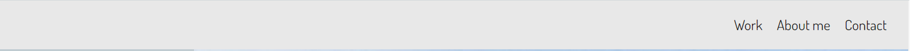
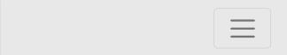
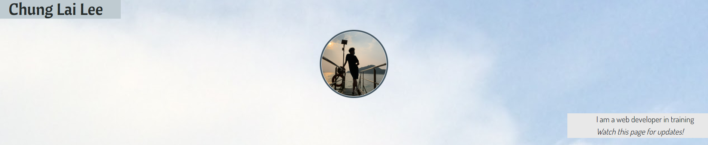
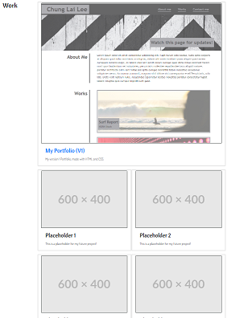
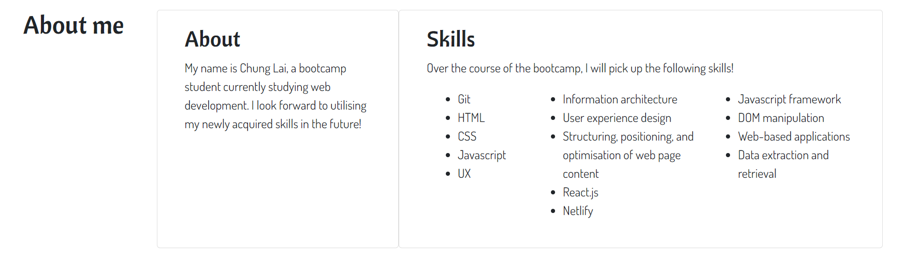
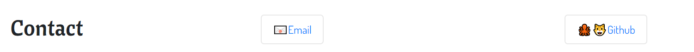

# Bootstrap-Portfolio

Welcome to the repo for my [Bootstrap Portfolio](https://cl-lee.github.io/Bootstrap-Portfolio/). As the names suggests, the webpage is made using Bootstrap (v4.3.1). Please click on the following URL to visit the webpage: https://cl-lee.github.io/Bootstrap-Portfolio/.

I am currently enrolled in a bootcamp for web development, this Portfolio will be updated to showcase my future works and projects.

## Site layout

The Portfolio webpage is divided into 5 major sections: 
1. Navigation Bar
2. Hero
3. Work
4. About me
5. Contact

## Viewing the Portfolio

1. The Navigation bar
    * Upon landing on the web page, visitors can click on the corresponding links in the Navigation bar to visit the "Work", "About me" and "Contact" sections.  
    

    * On mobile or smaller screens, visitors can click on the *hamburger button* instead to access the links in the collapsed Navigation bar.  
    

2. The Hero section
    * Alternatively, visitors can scroll down the page. Below the navigation bar is the Hero section, which displays my name, a picture of myself and a short commentary.  
    

3. The Work section
    * Further down is the Work section, where visitors will find five of my projects. A highlighted project will be displayed at the top of this section, followed by four other projects. *(Placeholders are used for some projects at the moment, this will be updated in the near future!)*  
    

4. About me section
    * Next is a section about myself. There are two sub-sections here. First is a description about myself, the other is about skills that I will acquire during my bootcamp studies.  
    

5. The Contact section
    * Lastly, we have a Contact section where visitors can discover ways to contact me and access my other online profiles.  
    